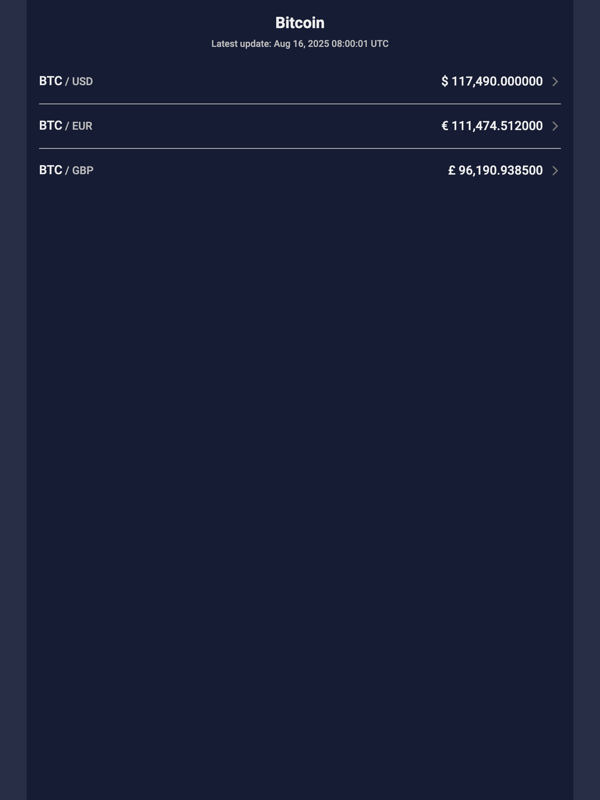
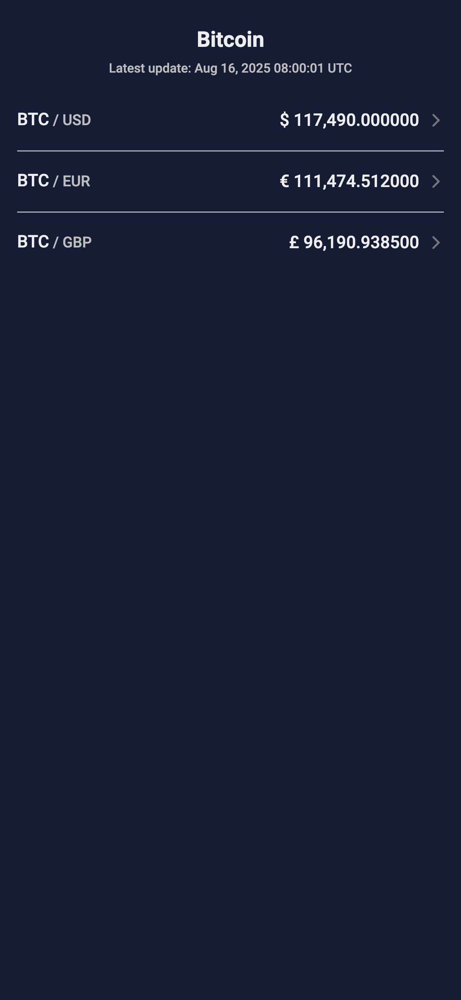
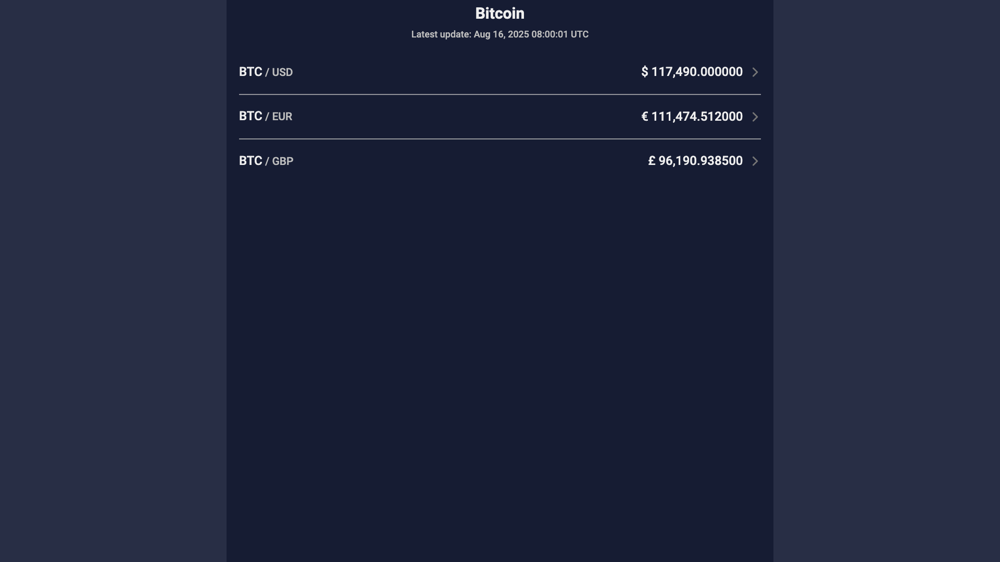

# Golden Tests for Create Customer Page

Golden tests are an effective way to ensure the user interface (UI) is visually consistent and behaves as expected across various states and screen sizes. In this project, I have implemented golden tests for the **Create Customer Page** to validate its UI across different devices and states using the **golden_toolkit** package.

## Purpose of Golden Tests

Golden tests help us:
- Verify the UI of each state without needing to run the application manually.
- Catch unintended changes in the UI during development.
- Test various states of the UI, which might be challenging to cover manually by QA teams or UI/UX designers.
- Ensure the app's responsiveness and functionality on different screen sizes.

## Device Configurations

I tested the Create Customer page on the following screen configurations:

- **phone_mini**
    - Size: `360x640`
    - Device Pixel Ratio: `3`

- **iphone14**
    - Size: `430x932`
    - Device Pixel Ratio: `3`
    - Safe Area Insets: `top: 59, bottom: 34`

- **ipad_mini**
    - Size: `768x1024`
    - Device Pixel Ratio: `2`
    - Safe Area Insets: `top: 24, bottom: 20`

- **surface_pro**
    - Size: `1280x720`
    - Device Pixel Ratio: `1.5`

## Benefits of Golden Tests

- **Visual Validation:** Helps validate the UI design and layout against predefined screenshots ("golden images").
- **Automated Testing:** Allows us to integrate these tests into CI pipelines (e.g., GitLab CI or GitHub Actions), enabling automated validation of UI changes on each pull request (PR).
- **Efficiency:** Reduces the manual effort needed for QA or designers to test UI states, especially for complex pages or multiple screen sizes.

## Implementation Notes

Using the **golden_toolkit** package, I rendered the screenshots for various states of the Create Customer page on the devices mentioned above. Each state was visually verified to ensure it matched the expected UI and functionality.

## How To Run/Generate Golden Tests

Use the below command to run golden tests:
`flutter test test_goldens/features/btc --dart-define=ENVIRONMENT=test`
Add `--update-goldens` to update and generate new golden images.

## Results

Here are some screenshots generated during the golden tests:

