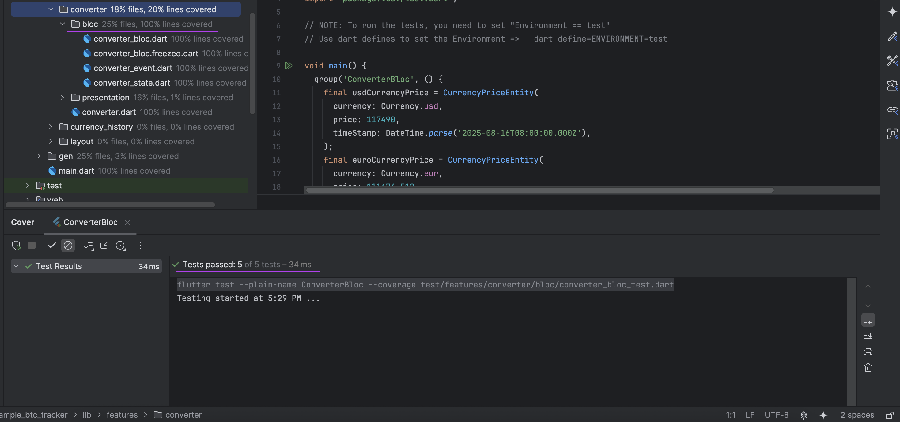

# Unit Tests

I wrote comprehensive unit tests for the **blocs** of both features:
- **BTCBloc**
- **ConverterBloc**

These tests were implemented using the following packages:

- `bloc_test`
- `flutter_test`
- `mockito`

## Key Highlights

- **100% Code Coverage**: All business logic in the blocs for both features is fully tested.
- **Mocking Dependencies**: Used `mockito` to mock repositories and services to isolate the tests and ensure reliability.

## Advantages of Unit Testing

Unit tests validate the functionality of individual components (in this case, the blocs) without needing to run the app. This ensures:

- **Code reliability**: Bugs are identified early.
- **Confidence in refactoring**: Changes in the codebase can be made without fear of breaking existing functionality.
- **Speed of development**: Automated testing saves time compared to manual testing.

## Test Results

The test results show that all blocs are working as expected. Below are the results:

## Next Steps

To maintain test quality, I recommend:
- Integrating unit tests into CI/CD pipelines (e.g., GitHub Actions, GitLab CI).
- Writing unit tests for additional layers, such as services and repositories, for more comprehensive test coverage.
